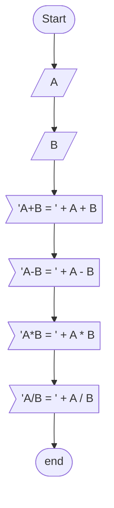

# algorithms_exercises
Exercises from the book Algorithms by Jose Augusto Navarro Garcia Manzano, Jayr Figueiredo de Oliveira

 Flowchart Map :mag: 

To better understand the Flowchart Diagrams, take a look at:

---

Chapter 3 - 

### [Ex.A](/ch3/a.c)

flowchart

### [Ex.B](/ch3/b.c)

flowchart

### [Ex.C](/ch3/c.c)

flowchart

### [Ex.D](/ch3/d.c)

flowchart

### [Ex.E](/ch3/e.c)

flowchart

### [Ex.F](/ch3/f.c)

flowchart

### [Ex.G](/ch3/g.c)

flowchart

### [Ex.H](/ch3/h.c)

flowchart

### [Ex.I](/ch3/i.c)

flowchart

### [Ex.J](/ch3/j.c)

flowchart

### [Ex.K](/ch3/k.c)

flowchart

### [Ex.L](/ch3/l.c)

flowchart

### [Ex.M](/ch3/m.c)

flowchart

### [Ex.N](/ch3/n.c)

flowchart

### [Ex.O](/ch3/o.c)

flowchart

### [Ex.P](/ch3/p.c)

flowchart

### [Ex.Q](/ch3/q.c)

flowchart

### [Ex.R](/ch3/r.c)

flowchart

### [Ex.S](/ch3/s.c)

flowchart

### [Ex.T](/ch3/t.c)

flowchart

---

Chapter 4 - Conditional :white_large_square: 

### Nothing YET

---

 

Chapter 5 - Loops :white_check_mark: 

### [Ex.A Power of two](/chapter_5/a.c)

 Flowchart 

### [Ex.B Math table](/chapter_5/b.c)

 Flowchart 

### [Ex.C Counting Numbers SUM](/chapter_5/c.c)

 Flowchart 

### [Ex.D EVEN SUM](/chapter_5/d.c)

 Flowchart 

### [Ex.E ODD Numbers ](/chapter_5/e.c)

 Flowchart 

### [Ex.F Divisibility by four ](/chapter_5/f.c)

 Flowchart 

### [Ex.G Power of three ](/chapter_5/g.c)

 Flowchart 

### [Ex.H Power of choices ](/chapter_5/h.c)

 Flowchart 

### [Ex.I Fibonacci](/chapter_5/i.c)

 Flowchart 

### [Ex.J Temperature](/chapter_5/j.c)

 Flowchart 

### [Ex.K Malba Tahan](/chapter_5/k.c)

 Flowchart 

### [Ex.L Factorial](/chapter_5/l.c)

 Flowchart 

### [Ex.M Mean Sum](/chapter_5/m.c)

 Flowchart 

### [Ex.N Sum and Mean](/chapter_5/n.c)

 Flowchart 

### [Ex.O Odd Factorial](/chapter_5/o.c)

 Flowchart 

### [Ex.P Mean Sum](/chapter_5/p.c)

 Flowchart 

### [Ex.Q Area Measurement](/chapter_5/q.c)

 Flowchart 

### [Ex.R Smallest Number and Biggest Number](/chapter_5/r.c)

 Flowchart 

### [Ex.S Division Operation](/chapter_5/s.c)

 Flowchart 

---

Chapter 6 - Matrices & Vectors :white_large_square: 

### [Ex.A](/ch6/a.c)

 Flowchart 

### [Ex.B](/ch6/b.c)

 Flowchart 

### [Ex.C](/ch6/c.c)

 Flowchart 

### [Ex.D](/ch6/d.c)

 Flowchart 

### [Ex.E](/ch6/e.c)

 Flowchart 

### [Ex.F](/ch6/f.c)

 Flowchart 

### [Ex.G](/ch6/g.c)

 Flowchart 

### [Ex.H](/ch6/h.c)

 Flowchart 

### [Ex.I](/ch6/i.c)

 Flowchart 

### [Ex.J](/ch6/j.c)

 Flowchart 

### [Ex.K](/ch6/k.c)

 Flowchart 

### [Ex.L](/ch6/l.c)

 Flowchart 

### [Ex.M](/ch6/m.c)

 Flowchart 

### [Ex.N](/ch6/n.c)

 Flowchart 

### [Ex.O](/ch6/o.c)

 Flowchart 

### [Ex.P](/ch6/p.c)

 Flowchart 

### [Ex.Q](/ch6/q.c)

 Flowchart 

### [Ex.R](/ch6/r.c)

 Flowchart 

### [Ex.S](/ch6/s.c)

 Flowchart 

### [Ex.T](/ch6/t.c)

 Flowchart 

### [Ex.U](/ch6/u.c)

 Flowchart 

### [Ex.V](/ch6/v.c)

 Flowchart 

### [Ex.W](/ch6/w.c)

 Flowchart 

### [Ex.X](/ch6/x.c)

 Flowchart 

### [Ex.Y](/ch6/y.c)

 Flowchart 

### [Ex.Z](/ch6/z.c)

 Flowchart 

---

Chapter 7 - Sorting & Search :white_check_mark:

### [EX.A Sorting a vector](/chapter_7/a.c)

 Flowchart 

### [Ex.B Binary Searching](/chapter_7/b.c)

 Flowchart 

### [Ex.C Elements' Factorial](/chapter_7/c.c)

 Flowchart 

### [Ex.D Vectors' sum](/chapter_7/d.c)

 Flowchart 

### [Ex.E Holding elements of two vectors](/chapter_7/e.c)

 Flowchart 

### [Ex.F Sequence Searching](/chapter_7/e.c)

 Flowchart 

### [Ex.G Binary Searching 2](/chapter_7/g.c)

 Flowchart 

### [Ex.H Operantion & Sorting](/chapter_7/h.c)

 Flowchart 

### [Ex.I Sorting a vector 2](/chapter_7/i.c)

 Flowchart 

### [Ex.J Math Operation & Factorial](/chapter_7/j.c)

 Flowchart 

### [Ex.K Pow & Sorting](/chapter_7/k.c)

 Flowchart 

### [Ex.L Operation & Sorting 2](/chapter_7/l.c)

 Flowchart 

### [Ex.M Sequence Searching 2](/chapter_7/m.c)

 Flowchart 

### [Ex.N Operation & Binary Search](/chapter_7/n.c)

 Flowchart 

### [Ex.O Binary Searching 3](/ch7/o.c)

 Flowchart 

### [Ex.P ABC Sorting](/ch7/p.c)

 Flowchart 

### [Ex.Q String Sorting and Binary Search](/ch7/q.c)

 Flowchart 

### [Ex.R String Sorting](/ch7/r.c)

 Flowchart 

### [Ex.S Sequence Searching 3](/ch7/s.c)

 Flowchart 

 

---

Chapter 8 :round_pushpin: 

### [Ex.A Two Dimension Vector](/chapter_8/a.c)

 Flowchart 

### [Ex.B Two Dimension Vector](/chapter_8/b.c)

 Flowchart 

### [Ex.C Columns and Lines 2D](/ch8/c.c)

 Flowchart 

### [Ex.D Factoring and Powering Columns](/ch8/d.c)

 Flowchart 

### [Ex.E Multiplying Columns](/ch8/e.c)

 Flowchart 

### [Ex.F Factorial 2D Arrays](/ch8/f.c)

 Flowchart 

### [Ex.G Convert Temperature 2D Array](/ch8/g.c)

 Flowchart 

### [Ex.H Main Diagonal ](/ch8/h.c)

 Flowchart 

### [Ex.I ](/ch8/i.c)

 Flowchart 

### [Ex.I ](/ch8/j.c)

 Flowchart 

---
